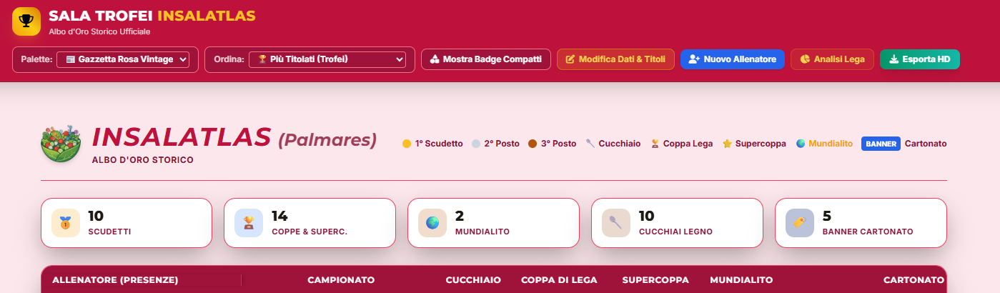

# InsalAtlas • Sala Trofei & Analytics Hub

[](https://github.com/fgizzarelliDS/insalatlas_sala_trofei/actions/workflows/deploy.yml)
[](https://github.com/fgizzarelliDS/insalatlas_sala_trofei/actions/workflows/validate-data.yml)
[](https://www.typescriptlang.org/)
[](LICENSE)

> Albo d'oro interattivo, analisi econometrica di competitività e schede manager per la lega Fantacalcio InsalAtlas.


---

## Panoramica

**InsalAtlas Sala Trofei** evolve il classico albo d'oro statico in un hub storico e di analisi per leghe Fantacalcio.

L'applicazione offre un'interfaccia interattiva per desktop e mobile, integrando la generazione ad alta risoluzione (HD) di schede manager condivisibili e un motore di analisi competitiva basato su teoria economica e modellazione del rischio.

- **Live Application**: [fgizzarellids.github.io/insalatlas_sala_trofei](https://fgizzarellids.github.io/insalatlas_sala_trofei/)
- **Database Ufficiale**: `public/data.json`



---

## Documentazione Tecnica Modulare

La documentazione del progetto è suddivisa in guide tematiche dedicate in [`docs/`](docs/):

### 1. [Architettura & Invarianti Tecniche](docs/01-architecture-invariants.md)

Struttura a **7 colonne native** (`.albo-grid-row`), il motore di theming basato su Custom Properties CSS (Gala, Serie A, Gazzetta, Studio) e la pipeline di build con Vite.

### 2. [Funzionalità & Esperienza Utente](docs/02-features-and-ui.md)

Guida ai moduli applicativi: tabella interattiva con ordinamento multi-criterio, rendering off-screen in HD tramite `html2canvas`, copia istantanea negli appunti, condivisione formattata su WhatsApp e modalità di modifica protetta.

### 3. [Econometria, Cinismo & Modelli di Rischio](docs/03-analytics-and-econometrics.md)

Approfondimento matematico del modulo analitico:

- **Silverware Prestige Index (SPI)**: Ponderazione asimmetrica per difficoltà di torneo.
- **Macro-Parità di Lega**: Indici di Gini bivariati ($G_{\text{prestige}}$, $G_{\text{rating}}$), Concentrazione Top-3 ($CR_3$), Herfindahl-Hirschman Index ($\text{HHI}$) e Normalized Relative Entropy ($H_{\text{rel}}$).
- **Cinismo & Podi**: Frequenza podio ($PR$), Killer Instinct ($KI$) e Finals Conversion Rate.
- **Modellazione di Coda (Tail Risk)**: Feast-or-Famine Bayesiano ($\widetilde{FF}$), Net Tail Skew ($NTS$) e indice unificato Net Tail Index ($NTI$).
- **Tassonomia degli Archetipi**: Waterfall deterministico per la classificazione comportamentale dei manager.

### 4. [Data Schema & Validazione CI/CD](docs/04-data-schema-and-ci.md)

Specifiche del contratto dati `public/data.json`, validazione CI/CD tramite `scripts/validate.py` e GitHub Actions.

---

## Quick Start (Sviluppo Locale)

```bash
# 1. Clona il repository
git clone https://github.com/fgizzarellids/insalatlas_sala_trofei.git
cd insalatlas_sala_trofei

# 2. Installa le dipendenze
npm install

# 3. Valida l'integrità del database JSON
npm run validate:data
# oppure: python scripts/validate.py

# 4. Esegui la suite di test unitari
npm run test

# 5. Avvia il server di sviluppo locale
npm run dev

# 6. Type-checking TypeScript e build di produzione
npm run type-check
npm run build

# oppure per preview in locale
npm run preview --host
```
