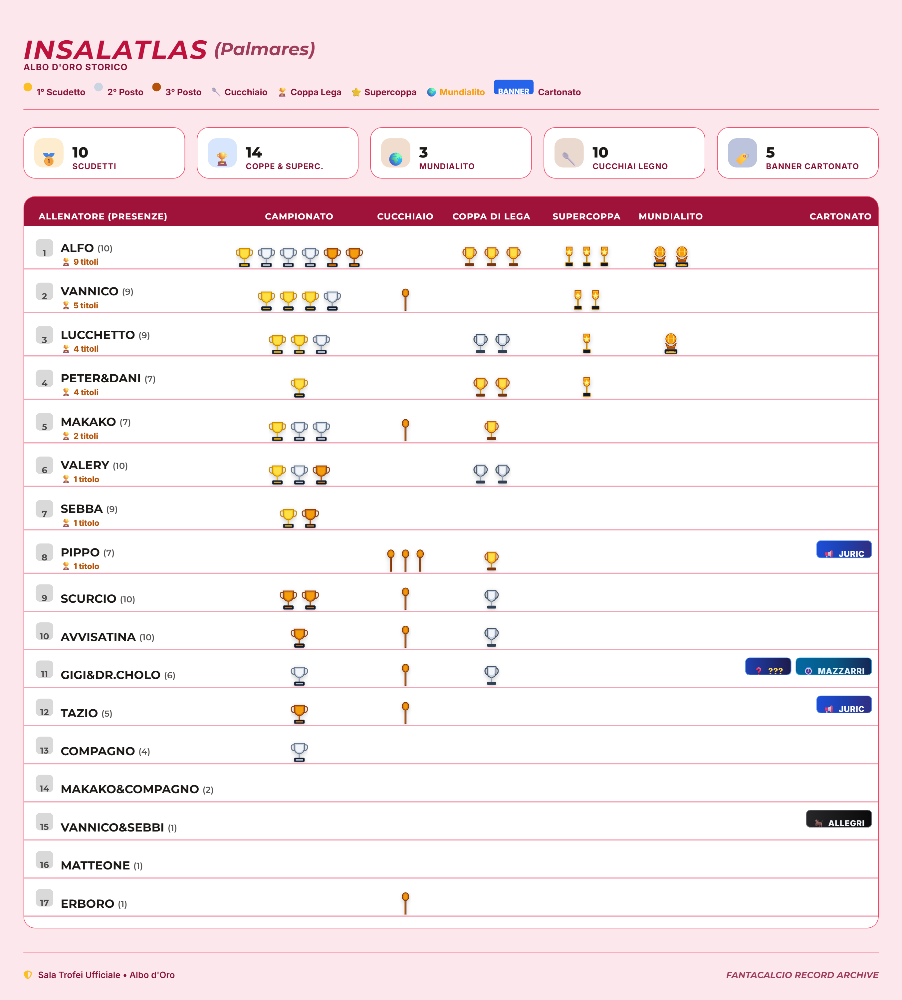

# 🏆 InsalAtlas • Sala Trofei & Palmarès Ufficiale 
**[Apri la Sala Trofei Online](https://fgizzarellids.github.io/insalatlas_sala_trofei/)**


Applicazione web broadcast-grade per la visualizzazione, la consultazione storica del palmarès e l'esportazione ad alta definizione (HD) dell'Albo d'Oro della lega Fantacalcio.

Ispirata al visual design sportivo contemporaneo, l'applicazione supporta il cambio runtime di quattro palette cromatiche, il tracciamento dinamico dei trofei ufficiali e dei riconoscimenti goliardici (*Cucchiaio di Legno* e *Banner Playout Cartonato*), un sistema integrato di backup JSON e l'esportazione grafica ad alta risoluzione (scala 2.2×) per la condivisione istantanea.

---

## 🏛️ Architettura Tecnica

Il progetto è sviluppato in **TypeScript (Strict Mode)** con bundler **Vite**:

### Struttura del Repository

```text
insalatlas_sala_trofei/
├── index.html                  # Entry point HTML principale
├── package.json                # Dipendenze e script npm (dev, build, preview)
├── tsconfig.json               # Configurazione TypeScript Strict Mode
├── vite.config.ts              # Configurazione Vite (base path relativa)
├── public/                     # Asset statici serviti alla radice
│   ├── data.json               # Single Source of Truth dei dati della lega
│   ├── preview.png             # Immagine di anteprima dell'applicazione
│   └── favicon*.png / .ico     # Icone dell'applicazione
├── images/                     # Risorse grafiche ed esempi di esportazione
│   ├── favicon_raw.png
│   └── Palmares_example.png
├── css/
│   ├── themes.css              # Variabili custom CSS per le 4 palette cromatiche
│   └── layout.css              # 7-column CSS Grid, mensola trofei e layout responsive
└── src/
    ├── types.ts                # Interfacce TypeScript (Manager, AppState, TitlesConfig, etc.)
    ├── config.ts               # Pesi di punteggio ufficiali e titoli predefiniti
    ├── state.ts                # Store di stato reattivo condiviso
    ├── score.ts                # Algoritmi di rating ponderato e ordinamento
    ├── trophies.ts             # Generatori SVG vettoriali e banner allenatori
    ├── storage.ts              # Fetch dati, persistenza locale e import/export backup
    ├── ui.ts                   # Gestione temi, notifiche toast e inline editing
    ├── modals.ts               # Scheda profilo, modale admin e chiusura ESC/Backdrop
    ├── export.ts               # Pipeline di esportazione grafica HD (html2canvas)
    ├── main.ts                 # Bootstrap DOM, renderBoard() e bridge globale
    └── vite-env.d.ts           # Definizioni dei tipi per l'ambiente Vite
```

---

## 🎨 Caratteristiche Principali

- **Visualizzazione ad Albo d'Oro (Table Shelf)**: Allineamento millimetrico dei trofei su mensole orizzontali ad alto contrasto con griglia invariante a 7 colonne.
- **Vettorializzazione Nativa**: Tutte le coppe, i cucchiai, i mundialito e i badge sono renderizzati in puro SVG nativo, scalabile all'infinito senza perdita di qualità.
- **4 Temi Grafici Switchabili**:
  - 🌙 **Gala Dark Gold (`theme-gala`)**: Gradiente radiale blu notte/nero con accenti dorati (#f59e0b) in stile cerimonia di gala.
  - ⚡ **Serie A Cyan Night (`theme-seriea`)**: Tonalità blu navy profondo con dettagli ciano brillante (#06b6d4) ispirati ai riflettori degli stadi.
  - 📰 **Gazzetta Rosa Vintage (`theme-gazzetta`)**: Sfondo rosa cartaceo editoriale (#fce7ec), testata cremisi (#be123c) e schede bianche.
  - 📋 **Clean Studio White (`theme-studio`)**: Minimalismo contemporaneo in ardesia chiara (#f1f5f9) con accenti blu royal (#2563eb).
- **Chiusura Ergonomica delle Modali**: Le schede profilo e i pannelli di modifica possono essere chiusi con il tasto **`Esc`** o cliccando sullo sfondo scuro esterno.
- **Esportazione Grafica HD (1-Click PNG)**: Generatore canvas ad alta risoluzione (scala 2.2×) con palette attiva per il download immediato dell'Albo d'Oro.
  <details>
    <summary> <strong>Mostra esempio di grafica esportata</strong> </summary>
    <br>
    
  </details>
- **Tracciamento Completo dei Riconoscimenti**:
  - 🥇 Podio Campionato (1° Scudetto, 2° Posto, 3° Posto)
  - 🥄 Cucchiaio di Legno
  - 🏆 Coppa di Lega (Oro e Argento)
  - ⭐ Supercoppa di Lega
  - 🌍 Trofeo Mundialito
  - 🏷️ Banner Cartonato (Sconfitto ai Playout: *Juric, Mazzarri, Allegri, ???*)

---

## ⭐ Formula Ufficiale di Punteggio & Ranking Storico

Per calcolare il prestigio storico complessivo di ogni fantallenatore, l'applicazione applica un punteggio ponderato (`calculateManagerScore(m)`):

| Icona | Tipologia Trofeo / Riconoscimento | Punti Assegnati | Descrizione |
| :---: | :--- | :---: | :--- |
| 🥇 | **1° Posto Campionato (Scudetto)** | **+3.00 pt** | Campione d'Italia di Lega |
| 🏆 | **Coppa di Lega (Oro)** | **+2.00 pt** | Vincitore della coppa a eliminazione diretta |
| ⭐ | **Supercoppa di Lega** | **+1.00 pt** | Vincitore della sfida di apertura stagione |
| 🌍 | **Trofeo Mundialito** | **+1.00 pt** | Torneo speciale o competizione internazionale |
| 🥈 | **2° Posto Campionato** | **+0.50 pt** | Vice-Campione della regular season |
| 🥈 | **Coppa di Lega (Argento)** | **+0.25 pt** | Finalista sconfitto in Coppa di Lega |
| 🥉 | **3° Posto Campionato** | **+0.25 pt** | Medaglia di bronzo della regular season |
| 🥄 | **Cucchiaio di Legno** | **0.00 pt** | Quarto classificato della regular season |
| 🏷️ | **Banner Cartonato (Playout)** | **-2.00 pt** | Retrocessione o sconfitta ai playout |

### Criteri di Ordinamento Disponibili

- **Più Titolati (`trophies_desc`)**: Somma dei titoli maggiori (Scudetto, Coppe Oro, Supercoppa, Mundialito) $\rightarrow$ Scudetti $\rightarrow$ Anni di militanza.
- **Rating Storico (`rating_desc`)**: Punteggio ponderato totale $\rightarrow$ Scudetti $\rightarrow$ Anni di militanza.
- **Scudetti Vinti (`scudetti_desc`)**: Scudetti $\rightarrow$ Secondi posti $\rightarrow$ Anni di militanza.
- **Anzianità di Lega (`years_desc`)**: Stagioni disputate $\rightarrow$ Scudetti.
- **Mundialito (`mundialito_desc`)**: Titoli Mundialito conquistati.
- **Cucchiai di Legno (`spoons_desc`)**: Ultimi posti collezionati.
- **Playout Cartonato (`cartonato_desc`)**: Maggior numero di banner cartonato accumulati.

---

## 🛠️ Comandi di Sviluppo

```powershell
# Installa le dipendenze
npm install

# Avvia l'ambiente di sviluppo locale con Hot Module Replacement (HMR):
npm run dev

# Verifica i tipi TypeScript (Strict Mode):
npm run type-check

# Compila il bundle ottimizzato per la produzione in dist/:
npm run build

# Esegui la preview del bundle di produzione:
npm run preview
```

---

## 🔄 Guida all'Aggiornamento dei Dati

1. **Abilita la Modalità Modifica**:
   - Apri il sito e clicca su **`Modifica Dati & Titoli`**.
   - Inserisci la password amministratore.
2. **Aggiorna i Record**:
   - Clicca sulla riga dell'allenatore da aggiornare per aprire il form.
   - Incrementa le presenze (`+1`) e inserisci i nuovi trofei conquistati.
   - Clicca su **`Salva Modifiche`**.
3. **Esporta il Backup**:
   - Clicca su **`Salva Backup JSON`** per scaricare il file aggiornato.
4. **Applica le Modifiche su GitHub**:
   - Copia il contenuto aggiornato nel file [`public/data.json`](public/data.json).
   - Esegui il commit sul repository.
